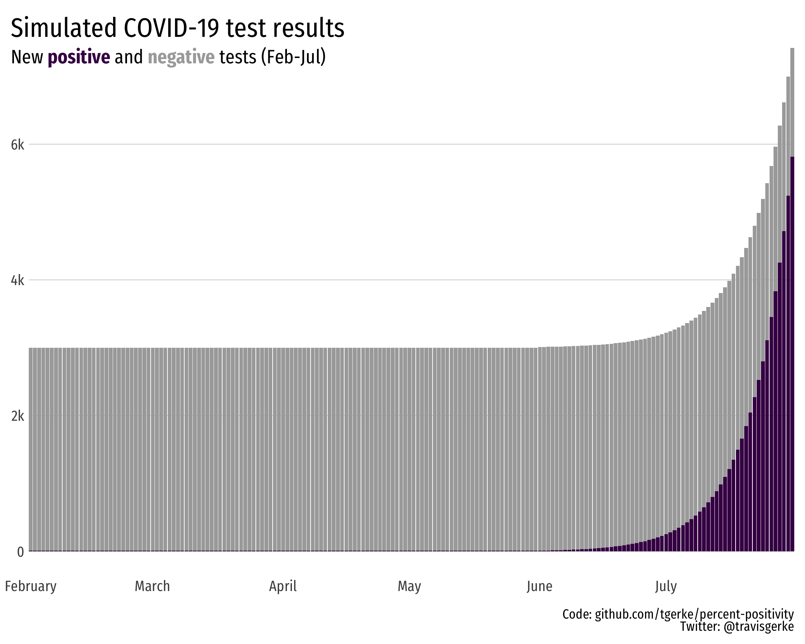
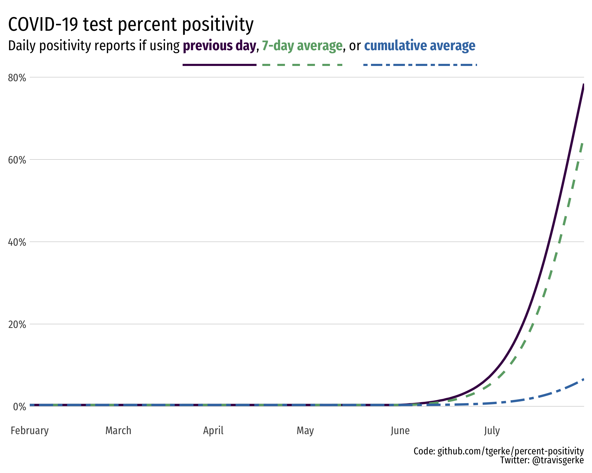

COVID-19 percent positivity: calculations and interpretations
=====================
  
Cumulative percent test positivity (e.g. current state of Florida DOH practice) is a misleading measure to report without a time reference. Implicitly, this cumulative proportion is calculated over the entire duration of the pandemic, and provides little insight for citizens seeking statistics that summarize current trends in the outbreak. Reporting over a range, such as 7-day or 14-day positivity, would be a more appropriate statistic. 

Two pairs of figures follow. The first pair is based on simulated data that mimics low case load for several months with consistent testing capacity, followed by an outbreak with increased testing capacity. Percent test positivity on the final day of the outbreak is 78% with a 7-day average of 66%, while the cumulative percent positivity is only 7%.

The second figure pair is real pediatric COVID-19 data from the [Florida DOH reporting site](http://ww11.doh.state.fl.us/comm/_partners/covid19_report_archive/). For pediatric cases, percent positivity during the month of July is over 80%, while media reports of the cumulative percent positivity are citing 31%. The unusually high hospitalization rate (1-2%) among certain pediatric case groups reaffirms the implication of a high positivity rate: predominantly symptomatic children are being tested. 

